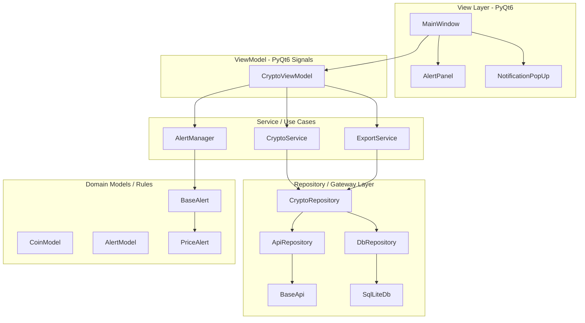

# Crypto Currency & Exchange Rate Aggregator

Десктопное приложение на Python и PyQt6 для мониторинга курсов криптовалют с различных бирж (Binance, CoinGecko) в реальном времени, расчета арбитражного спреда с учетом комиссий, сохранения истории цен в локальную базу данных, экспорта отчетов и настройки динамических уведомлений (Alerts).

Проект спроектирован с упором на принципы **SOLID**, **Чистую Архитектуру (Clean Architecture)** и шаблон **MVVM (Model-View-ViewModel)**.

---

## Архитектура проекта

Проект строго разделен на независимые слои в соответствии с Dependency Rule (зависимости направлены внутрь, от деталей к бизнес-логике).



### 1. Слой представления (View Layer)
*   **Состав:** `MainWindow`, `AlertPanel`, `NotificationPopUp`.
*   **Ответственность:** Отображение интерфейса, сбор ввода пользователя (кнопки, формы ввода, комбобоксы) и отрисовка данных.
*   **Связь:** Не содержит бизнес-логики и прямого доступа к данным. Напрямую зависит только от `CryptoViewModel`. Обновления получает через реактивные сигналы PyQt.

### 2. Слой ViewModel (Interface Adapters)
*   **Состав:** `CryptoViewModel`.
*   **Ответственность:** Адаптация данных между сервисами бизнес-логики и представлением. Управляет жизненным циклом фоновых потоков (QThread) для получения цен, транслирует команды от View к сервисам и генерирует реактивные сигналы (`actual_price`, `trigger_alert`, `history_data`, `export_res`) для обновления View.

### 3. Слой бизнес-логики (Service / Use Cases)
*   **Состав:** `CryptoService`, `ExportService`, `AlertManager`.
*   **Ответственность:** 
    *   `CryptoService` выполняет вычисление арбитражных показателей (чистый спред с учетом комиссий разных бирж).
    *   `ExportService` координирует экспорт исторических данных в файлы.
    *   `AlertManager` управляет активными правилами слежения (Alerts) в памяти и проверяет их срабатывание при каждом обновлении цен.

### 4. Слой доступа к данным (Repository Layer)
*   **Состав:** `CryptoRepository`, `ApiRepository`, `DbRepository`.
*   **Ответственность:** Абстракция источников данных (**Repository Pattern**).
    *   `CryptoRepository` предоставляет единый интерфейс доступа к данным, объединяя сетевые запросы и базу данных.
    *   `ApiRepository` управляет HTTP-клиентами для обращения к внешним REST API.
    *   `DbRepository` работает с локальным хранилищем данных через SQLAlchemy.

### 5. Доменные сущности (Entities / Domain Layer)
*   **Состав:** `CoinModel`, `AlertModel`, `BaseAlert`, `PriceAlert`.
*   **Ответственность:** Базовые структуры данных и ключевые бизнес-правила (например, логика проверки выполнения условий алерта). Этот слой полностью независим от внешних библиотек (за исключением стандартных структур Python) и других слоев.

---

## Примененные паттерны проектирования

1.  **Repository (Репозиторий):** Разделение логики хранения данных и их использования. `CryptoRepository` скрывает от сервисов детали того, откуда берутся цены — из сети (`ApiRepository`) или из кэша базы данных (`DbRepository`).
2.  **Strategy (Стратегия):**
    *   **Экспорт отчетов:** Интерфейс `BaseExporter` и стратегии `CsvExporter`, `HtmlExporter`, `JsonExporter` для сохранения отчетов в различных форматах без изменения вызывающего кода.
    *   **Расчет комиссий:** Интерфейс `BaseFeeStrategy` и стратегии `BinanceFee`, `CoinGekoFee` для гибкого расчета чистой стоимости покупки и продажи с учетом комиссионных тарифов каждой конкретной биржи.
3.  **Factory (Фабрика):** 
    *   Регистрация стратегий экспорта через `ExporterFactory`.
    *   Регистрация стратегий комиссий через `FeeFactory`.
    *   Динамическое создание объектов алертов на основе их типов через `AlertFactory` с автоматической валидацией параметров по спецификации `@classmethod get_fields()`.
4.  **Template Method (Шаблонный метод):**
    Выделение общей логики отправки HTTP-запросов, логирования и обработки ошибок в абстрактный класс `BaseApi`. Конкретные наследники (`BinanceApi`, `CoinGeckoApi`) реализуют только уникальные детали: формирование URL-строк и парсинг специфичных для биржи JSON-ответов.

---

## Технологический стек

*   **Язык:** Python 3.12 (со строгой типизацией PEP 484)
*   **Библиотека GUI:** PyQt6 (поддерживает асинхронные рабочие потоки через QThread)
*   **База данных:** SQLite (интеграция через SQLAlchemy)
*   **Инструменты:**
    *   `requests` для работы с REST API
    *   `tabulate`/`csv` для форматирования отчетов

---

## Запуск проекта

1. Установите зависимости:
   ```bash
   pip install -r requirements.txt
   ```

2. Запустите приложение:
   ```bash
   python3 -m crypto_currency_aggregator.main
   ```
